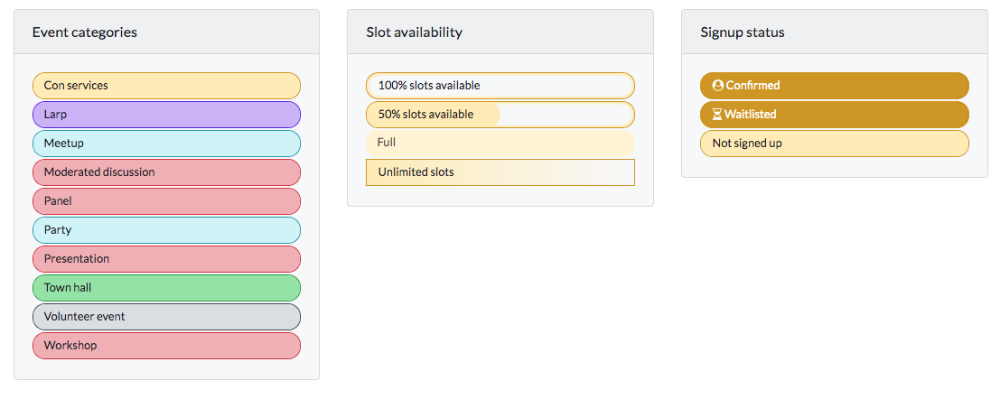
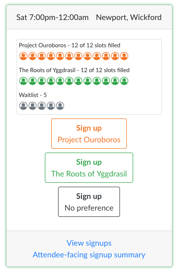
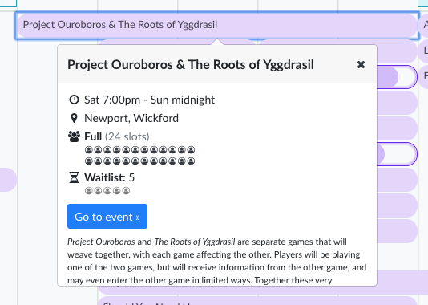

We're rolling out some changes to how the schedule and run buckets display in Intercode 2. Here’s the highlights:

<!--truncate-->

## Schedule

- Instead of having a thin green bar that empties as people sign up for an event, the event will have rounded ends, and act as a progress bar that goes up as people sign up. Once the event is full, it will be lightened to show that it is full.
- Events that have unlimited slots will remain rectangular, and have a gradient background to show that you can sign up for them.
- Events that have no slots (i.e. consuite) will remain rectangular, and have a solid background.
- The "you are signed up for this game" has changed to a user/head icon instead of the checkbox that looked like an interactive element.
- The concom only "Schedule With Counts" view has been updated to show the percentage of signups in the same style, as a background progress bar on each event.
- The sorting of events on the schedule has been updated to better group multiple runs of events together if they’re sequential.

### Schedule Legend Example

## Signup Buckets

- Instead of having a broken line that turns from colored segments to gray, we’re displaying a set of empty circles that get replaced by the same user/head icon that we use on the schedule as people sign up. This should be easier to read at a glance.
- When you click on a run in the schedule view, the same set of circles/heads are displayed there as well.

### Signup Bucket Examples

